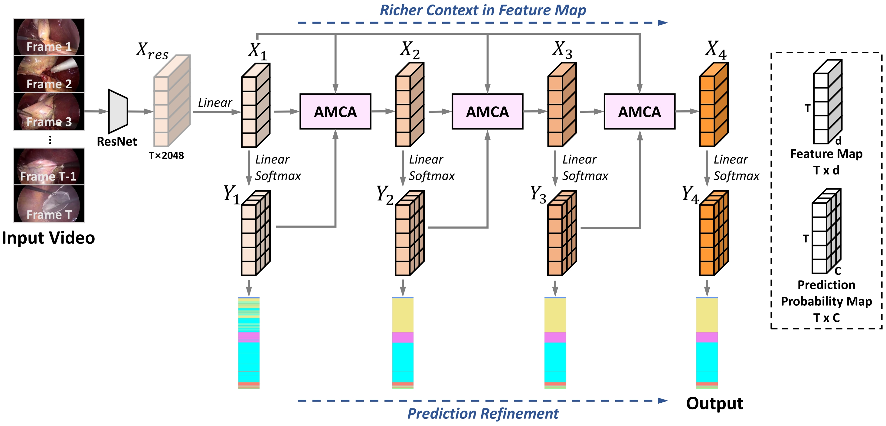

<h2 align="center"> [TMI2023] Cascade Multi-Level Transformer Network for Surgical Workflow Analysis </h2>
<p align="center">
<a href="https://ieeexplore.ieee.org/document/10098668">"></a>
</p>
<h5 align="center"><em>Wenxi Yue, Hongen Liao, Yong Xia, Vincent Lam, Jiebo Luo, Zhiyong Wang</em></h5>
<p align="center">
  <a href="#news">News</a> |
  <a href="#abstract">Abstract</a> |
  <a href="#installation">Installation</a> |
  <a href="#data">Data</a> |
  <a href="#checkpoints">Checkpoints</a> |
  <a href="#train">Train</a> |
</p>

## News 

Our paper is accepted to **IEEE Transactions on Medical Imaging 2023**. 


## Abstract 
Surgical workflow analysis aims to recognise surgical phases from untrimmed surgical videos. It is an integral component for enabling context-aware computer-aided surgical operating systems. Many deep learning-based methods have been developed for this task. However, most existing works aggregate homogeneous temporal context for all frames at a single level and neglect the fact that each frame has its specific need for information at multiple levels for accurate phase prediction. To fill this gap, in this paper we propose Cascade Multi-Level Transformer Network (CMTNet) composed of cascaded Adaptive Multi-Level Context Aggregation (AMCA) modules. Each AMCA module first extracts temporal context at the frame level and the phase level and then fuses frame-specific spatial feature, frame-level temporal context, and phase-level temporal context for each frame adaptively. By cascading multiple AMCA modules, CMTNet is able to gradually enrich the representation of each frame with the multi-level semantics that it specifically requires, achieving better phase prediction in a frame-adaptive manner. In addition, we propose a novel refinement loss for CMTNet, which explicitly guides each AMCA module to focus on extracting the key context for refining the prediction of the previous stage in terms of both prediction confidence and smoothness. This further enhances the quality of the extracted context effectively. Extensive experiments on the Cholec80 and the M2CAI datasets demonstrate that CMTNet achieves state-of-the-art performance.



<figcaption align = "center"><b>Figure 1: Overview of CMTNet. 
 </b></figcaption>


## Installation

1. Clone the repository.
      ```
      git clone https://github.com/wenxi-yue/CMTNet.git
      cd CMTNet
      ```

2. Create a virtual environment for CMTNet and and activate the environment.
    ```
    conda create -n cmtnet python=3.9 -y
    conda activate cmtnet
    ```
3. Install Pytorch and TorchVision. In our case, we use `pip install torch==1.11.0+cu113 --extra-index-url https://download.pytorch.org/whl/cu113`. Please follow the instructions [here](https://pytorch.org/get-started/locally/) for installation in your specific condition. 

4. Install other dependencies.
    ```
    pip install -r requirements.txt
    ```

## Data
We use the [Cholec80](http://camma.u-strasbg.fr/datasets/) [1] and [M2CAI](http://camma.u-strasbg.fr/m2cai2016/) [2] datasets in our experiments. 

We provide the pre-computed ResNet features and ground-truth annotations [here](https://unisyd-my.sharepoint.com/:f:/g/personal/wenxi_yue_sydney_edu_au/ErORQ6J492dLgy3emlb_YWYB4N3a0KRg9uInpq6SXRSZ-A?e=FViES6).


## Checkpoints
We provide the checkpoints for reproducing the results in our paper [here](https://unisyd-my.sharepoint.com/:f:/g/personal/wenxi_yue_sydney_edu_au/ErORQ6J492dLgy3emlb_YWYB4N3a0KRg9uInpq6SXRSZ-A?e=FViES6). Please note that we repeat the experiments four times and report the average results in the paper. Accordingly, we have included the checkpoints for all four repetitions.

##  File Organisation
After downloading the data, the files should be organised as follows.

  ```tree
  CMTNet
      |__assets
      |    ...
      |__data
      |    |__cholec80
      |    |       |__groundtruth
      |    |       |__resnet_features
      |    |       |__mapping.txt
      |    |       |__test.bundle
      |    |                   
      |    |__m2cai
      |            |__groundtruth
      |            |__resnet_features
      |            |__mapping.txt
      |            |__test.bundle
      |                   
      |__data.py
      |__eval.py
      |__loss.py
      |__main.py
      |__model.py
      |__train.py
      |__ ...
  ```

##  Train
To train the model:
```
cd CMTNet/
python main.py  --dataset cholec80 | tee  log_cholec80.out
python main.py  --dataset m2cai | tee  log_m2cai.out
```


##  Citing CMTNet

If you find our work helpful, please consider citing:
```
@article{yue_cmtnet,
  title={Cascade Multi-Level Transformer Network for Surgical Workflow Analysis},
  author={Yue, Wenxi and Liao, Hongen and Xia, Yong and Lam, Vincent and Luo, Jiebo and Wang, Zhiyong},
  journal={IEEE Transactions on Medical Imaging},
  year={2023},
  publisher={IEEE}
}
```


##  References
[1] A. P. Twinanda, S. Shehata, D. Mutter, J. Marescaux, M. de Mathelin, and N. Padoy, “EndoNet: A deep architecture for recognition tasks on laparoscopic videos,” IEEE Trans. Med. Imag., vol. 36, no. 1, pp. 86–97, Jan. 2017.

[2] A. P. Twinanda, S. Shehata, D. Mutter, J. Marescaux, M. De Mathelin, and N. Padoy. (2016). Workshop and Challenges on Modeling and Monitoring of Computer Assisted Interventions. [Online]. Available: http://camma.u-strasbg.fr/m2cai2016/.
